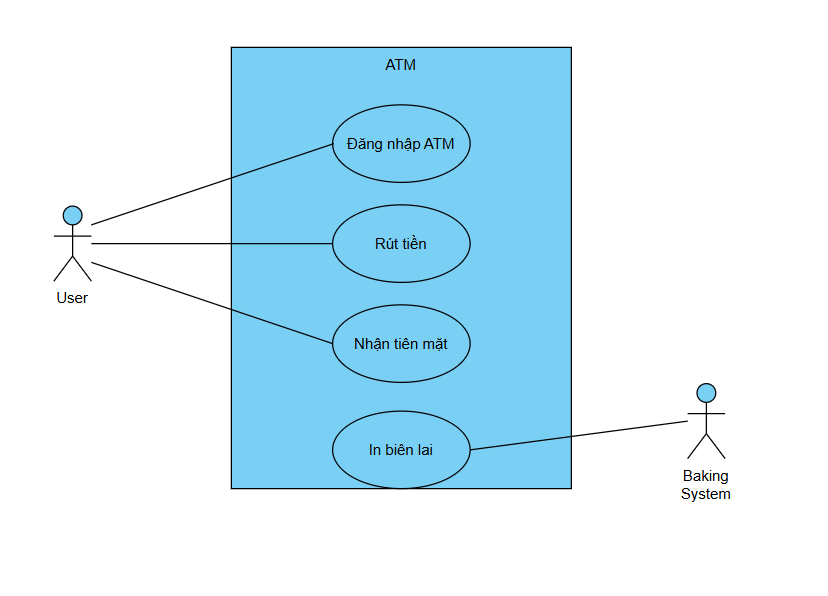
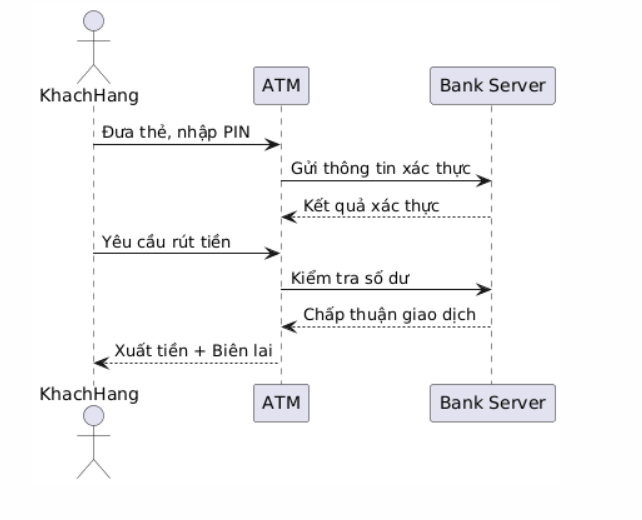

# Lab 03 – UML Thiết kế (Use Case & Sequence Diagram)

## Mục tiêu
- Mô tả luồng tương tác chi tiết của hệ thống ATM.
- Vẽ **Use Case Diagram (UC)** và **Sequence Diagram (SQ)** cho một quy trình nghiệp vụ.
- Giải thích các đối tượng tham gia và thông điệp trao đổi.

## Nội dung
- Dựa trên **ATM Mini Project**:
  - Vẽ **Use Case Diagram** trong thư mục `usecases/`.
  - Vẽ **Sequence Diagram** trong thư mục `diagrams/`.
  - Viết mô tả chi tiết trong `descriptions/ATM-usecases.md`.

## Kết quả
- **Use Case Diagram:**   
- **Sequence Diagram:**   
- **Mô tả:** [ATM.md](descriptions/ATM.md)  

