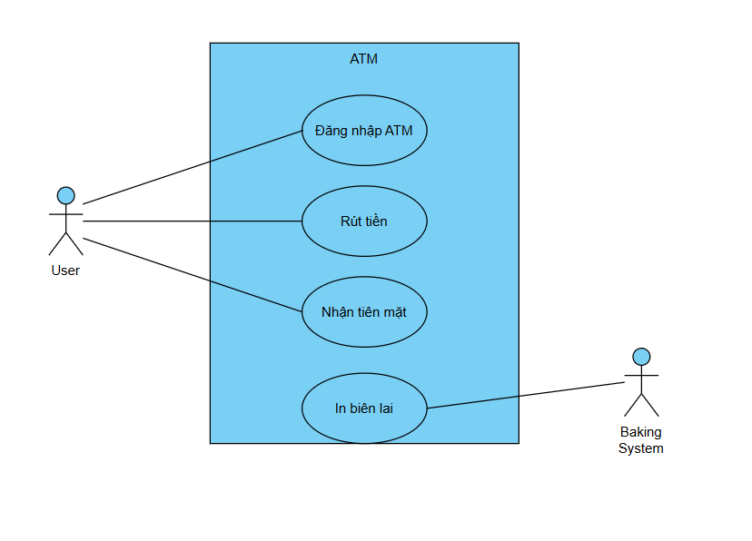
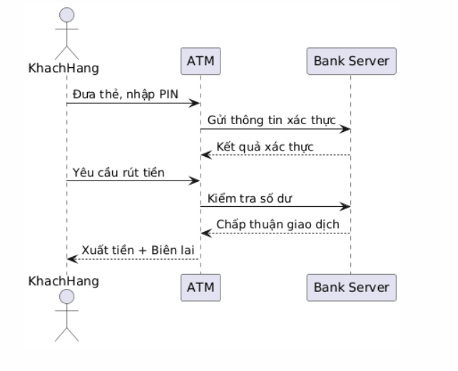

# Lab 05 – Project Report

## 1. Mục tiêu
Hoàn thiện quy trình phần mềm từ thiết kế đến triển khai.

## 2. Quy trình làm việc
1. Thiết kế Use Case Diagram.
2. Thiết kế Sequence Diagram.
3. Lập trình Form Login (Lab 04).
4. Tích hợp tất cả artifacts vào repository.

## 3. Artifacts
- Use Case Diagram: 
- Sequence Diagram: 
- Form Login code: [text](lab04/index.html)

## 4. Hướng dẫn chạy
1. Mở `lab04/index.html` trên trình duyệt.
2. Nhập Username/Password để thử chức năng login.

## 5. Version
- Tag version: v1.0
