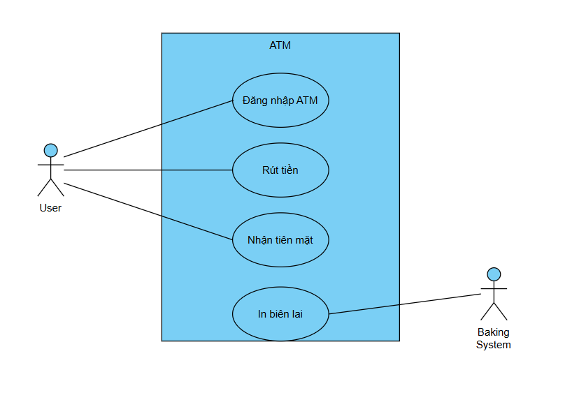
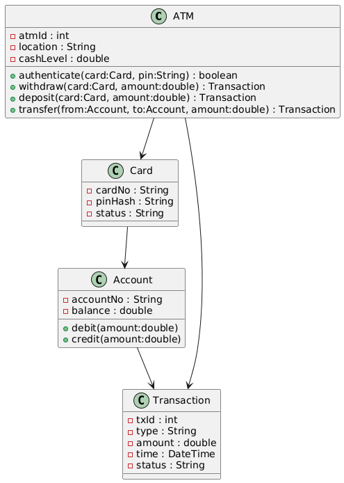
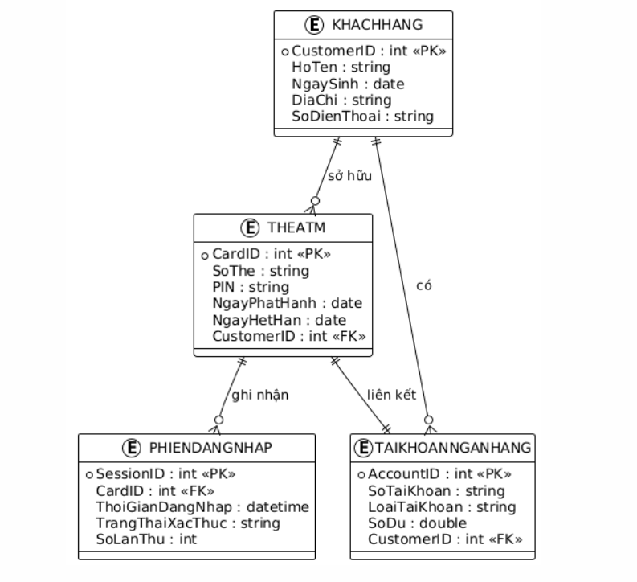

# Lab 10 – Báo cáo tổng hợp & Demo cuối kỳ

## 1. Giới thiệu

Dự án **ATM Mini Project** được xây dựng trong suốt các Lab từ 01 → 09 nhằm mô phỏng quy trình phát triển phần mềm theo mô hình **Scrum/Agile**.
Mục tiêu:

* Thực hành quản lý dự án phần mềm trên GitHub & Jira
* Áp dụng UML trong phân tích & thiết kế hệ thống
* Lập trình front-end, back-end mô phỏng ATM
* Thực hiện kiểm thử và báo cáo tích hợp cuối kỳ

---

## 2. Mô hình UML

### 2.1 Use Case Diagram 

### 2.2 Sequence Diagram 

### 2.3 Class Diagram & Package 

---

## 3. Database & Code minh hoạ

### 3.1 ERD & Database 

### 3.2 Form Login 
[text](index.html)
### 3.3 Module Withdraw 
[text](withdraw.py)
---
## 4. Kiểm thử & Sprint Report

### 4.2 Jira Report
[text](report.md)
---

## 6. Kết luận & Định hướng mở rộng

* Dự án đã tích hợp toàn bộ artifacts từ Lab 01 → 09 thành một **Mini Project ATM** hoàn chỉnh.
* Thực hiện thành công từ bước phân tích yêu cầu, thiết kế, coding, testing đến quản lý dự án.

---

